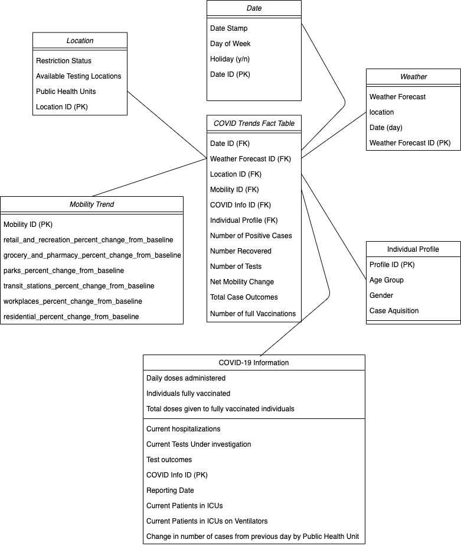

---
output:
  pdf_document: 
    includes:
        before_body: CoverPage.sty
---

(See Last Page for Conceptual Model Figure)

## Fact Table

### Grain
Covid Outbreak Status(Number of Positive COVID Cases, Number of Recovered COVID Cases, Number of Recovered COVID Cases, Number of Tests, Number of Hospitalization, Number of Case Outcomes, Number of Full Vaccinations)
per Location, per Day, per Individual Profile Classification

### Fact Table Attributes

#### Foreign Keys
- Date ID (FK) 
- Weather Forecast ID (FK)
- Location ID (FK)
- Mobility Trend ID (FK)
- COVID Outbreak Status ID (FK)
- Individual Profile (FK)

#### Facts/Measures

- Number of Postive Cases
- Number Recovered
- Number of Tests
- Total Hospitalization
- Total case outcomes (resolutions and deaths)
- Number of full Vaccinations
- Net Mobility Trend Change

## Dimensions 
- Weather Dimension
  - Weather Forecast
  - Location
  - Date(Day)
- Date Dimension
  - Date Stamp (date, minimum = 0001-01-01 and maximum = 9999-12-31, Sample value = 2020-10-01)
  - Day of the week
  - Holiday (y/n)
- Location Dimension 
  - Available Testing Locations
  - Public Health Units
  - Restriction Status
- Individual Profile
  - Age Group
  - Gender
  - Case Acquisition
- Mobility Trend
  - retail and recreation percent change from baseline	
  - grocery and pharmacy percent change from baseline	
  - parks percent change from baseline	
  - transit stations percent change from baseline	
  - workplaces percent change from baseline	
  - residential percent change from baseline
- COVID Outbreak Status
  - reporting date
  - individuals fully vaccinated
  - current hospitalizations
  - tests under investigation
  - test outcomes
  - current tests under investigation
  - current patients in Intensive Care Units (ICUs)
  - current patients in Intensive Care Units (ICUs) on ventilators
  - change in number of cases from previous day by Public Health Unit (PHU)

### DataSets Used 

- Status of COVID-19 [(Link)](https://data.ontario.ca/dataset/status-of-covid-19-cases-in-ontario)
  - reporting date
  - daily tests completed
  - total tests completed
  - test outcomes
  - total case outcomes (resolutions and deaths)
  - current tests under investigation
  - current hospitalizations
  - current patients in Intensive Care Units (ICUs)
  - current patients in Intensive Care Units (ICUs) on ventilators
  - change in number of cases from previous day by Public Health Unit (PHU)

- COVID-19 testing locations [(Link)](https://data.ontario.ca/dataset/covid-19-assessment-centre-locations)
  - Location name
  - Location operator
  - Physical address
  - Phone number
  - Website
  - Public Health Unit (PHU)
  - Latitude
  - Longitude
  - Physical address
  - Phone number
  - Hours of operation
  - Age restrictions
  - Appointment requested
  - Drive through availability
  - Walk in availability
  - Temporary closure
  - Active centre (indefinite closures

- Confirmed positive cases of COVID-19 in Ontario [(Link)](https://data.ontario.ca/en/dataset/confirmed-positive-cases-of-covid-19-in-ontario)
  - approximation of onset date
  - age group
  - patient gender
  - case acquisition information
  - patient outcome
  - reporting Public Health Unit (PHU)
  - postal code, website, longitude, and latitude of PHU

- COVID-19 Vaccine Data in Ontario [(Link)](https://data.ontario.ca/dataset/covid-19-vaccine-data-in-ontario)
  - daily doses administered
  - total doses administered
  - individuals fully vaccinated
  - total doses given to fully vaccinated individuals

- Community Mobility Reports [(Link)](https://www.google.com/covid19/mobility/)

- Restrictions [(Link)](https://data.ontario.ca/dataset/ontario-covid-19-zones/resource/ce9f043d-f0d4-40f0-9b96-4c8a83ded3f6)
  - Reporting PHU
  - Status PHU
  - Start Date
  - End Date
  - PHU url

- Daily Weather Data Ottawa [(Link)](https://climate.weather.gc.ca/climate_data/daily_data_e.html?hlyRange=%7C&dlyRange=1889-11-01%7C2021-01-07&mlyRange=1889-01-01%7C2006-12-01&StationID=4333&Prov=ON&urlExtension=_e.html&searchType=stnName&optLimit=yearRange&StartYear=1840&EndYear=2021&selRowPerPage=25&Line=7&searchMethod=contains&Month=12&Day=31&txtStationName=Ottawa&timeframe=2&Year=2020)
  - TIME
  - Temp °C
  - Dew Point °C
  - Rel Hum %
  - Precip. Amount mm
  - Wind Dir (10's deg)
  - Wind Spd km/h
  - Visibility km
  - Stn Press (kPa)
  - Hmdx
  - Wind Chill
  - Weather

- Daily Weather Data Toronto [(Link)](https://climate.weather.gc.ca/climate_data/hourly_data_e.html?hlyRange=2009-12-10%7C2021-01-31&dlyRange=2010-02-02%7C2021-01-31&mlyRange=%7C&StationID=48549&Prov=ON&urlExtension=_e.html&searchType=stnName&optLimit=yearRange&StartYear=2020&EndYear=2021&selRowPerPage=25&Line=2&searchMethod=contains&Month=1&Day=31&txtStationName=toronto&timeframe=1&Year=2021)
  - TIME
  - Temp °C
  - Dew Point °C
  - Rel Hum %
  - Precip. Amount mm
  - Wind Dir (10's deg)
  - Wind Spd km/h
  - Visibility km
  - Stn Press (kPa)
  - Hmdx
  - Wind Chill
  - Weather

