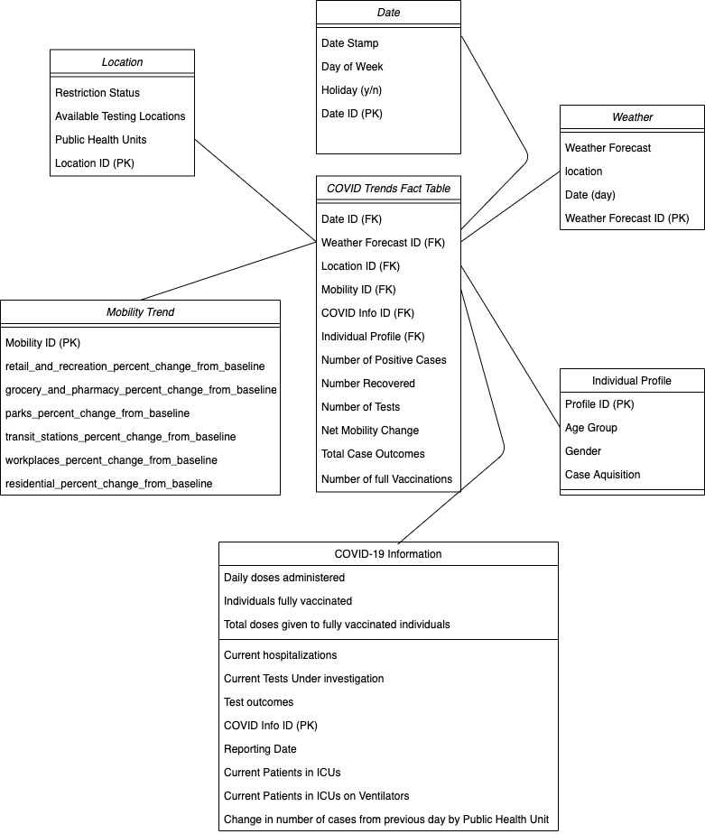

---
output:
  pdf_document:
    includes:
        before_body: CoverPage.sty
---

(See Last Page for Conceptual Model Figure)

## Work Plan

## 26-01-2021 Tuesday 6:00-8:00
- Discussed member roles
- Assigned coordinator and scribe
- Discussed regular meet-up date and times
- Discussed Project plan
- Registered the group
- Brainstormed potential resources to utilize for project

## 29-01-2021 Friday 6:00-8:00
- Brainstormed ideas on tackling concept Model
- Brainstormed potential use of Constellation Schema
- Discussed latitude of dimension for concept model
- Looked for Data sets to support data mart

## 31-01-2021 Sunday 12:00-1:00
- Finalized conceptual model
- Assigned roles to group members on what should be accomplished in report

## Fact Table

### Grain
Covid Outbreak Status(Number of Positive COVID Cases, Number of Recovered COVID Cases, Number of Tests, Number of Hospitalization, Number of Case Outcomes, Number of Full Vaccinations)
per Location, per Day, per Individual Profile Classification

### Fact Table Attributes

#### Foreign Keys
- Date ID (FK)
- Weather Forecast ID (FK)
- Location ID (FK)
- Mobility Trend ID (FK)
- COVID Outbreak Status ID (FK)
- Individual Profile (FK)

#### Facts/Measures

- Number of Postive Cases
- Number Recovered
- Number of Tests
- Total Hospitalization
- Total case outcomes (resolutions and deaths)
- Number of full Vaccinations
- Net Mobility Trend Change

## Dimensions
- Weather Dimension
  - Weather Forecast
  - Location
  - Date(Day)
- Date Dimension
  - Date Stamp (date, minimum = 0001-01-01 and maximum = 9999-12-31, Sample value = 2020-10-01)
  - Day of the week
  - Holiday (y/n)
- Location Dimension
  - Available Testing Locations
  - Public Health Units
  - Restriction Status
- Individual Profile
  - Age Group
  - Gender
  - Case Acquisition
- Mobility Trend
  - retail and recreation percent change from baseline
  - grocery and pharmacy percent change from baseline
  - parks percent change from baseline
  - transit stations percent change from baseline
  - workplaces percent change from baseline
  - residential percent change from baseline
- COVID Outbreak Status
  - reporting date
  - individuals fully vaccinated
  - current hospitalizations
  - tests under investigation
  - test outcomes
  - current tests under investigation
  - current patients in Intensive Care Units (ICUs)
  - current patients in Intensive Care Units (ICUs) on ventilators
  - change in number of cases from previous day by Public Health Unit (PHU)

### DataSets Used

- Status of COVID-19 [(Link)](https://data.ontario.ca/dataset/status-of-covid-19-cases-in-ontario)

- COVID-19 testing locations [(Link)](https://data.ontario.ca/dataset/covid-19-assessment-centre-locations)

- Confirmed positive cases of COVID-19 in Ontario [(Link)](https://data.ontario.ca/en/dataset/confirmed-positive-cases-of-covid-19-in-ontario)

- COVID-19 Vaccine Data in Ontario [(Link)](https://data.ontario.ca/dataset/covid-19-vaccine-data-in-ontario)

- Community Mobility Reports [(Link)](https://www.google.com/covid19/mobility/)

- Restrictions [(Link)](https://data.ontario.ca/dataset/ontario-covid-19-zones/resource/ce9f043d-f0d4-40f0-9b96-4c8a83ded3f6)

- Daily Weather Data Ottawa [(Link)](https://climate.weather.gc.ca/climate_data/daily_data_e.html?hlyRange=%7C&dlyRange=1889-11-01%7C2021-01-07&mlyRange=1889-01-01%7C2006-12-01&StationID=4333&Prov=ON&urlExtension=_e.html&searchType=stnName&optLimit=yearRange&StartYear=1840&EndYear=2021&selRowPerPage=25&Line=7&searchMethod=contains&Month=12&Day=31&txtStationName=Ottawa&timeframe=2&Year=2020)

- Daily Weather Data Toronto [(Link)](https://climate.weather.gc.ca/climate_data/hourly_data_e.html?hlyRange=2009-12-10%7C2021-01-31&dlyRange=2010-02-02%7C2021-01-31&mlyRange=%7C&StationID=48549&Prov=ON&urlExtension=_e.html&searchType=stnName&optLimit=yearRange&StartYear=2020&EndYear=2021&selRowPerPage=25&Line=2&searchMethod=contains&Month=1&Day=31&txtStationName=toronto&timeframe=1&Year=2021)

\newpage

### Domain and Sample Values

| Date Dimension | Domain   | Sample   |
| ----------- | ----------- | ----------- |
| Date Stamp: Date | Four digit year, month, and day of the month | 2021-01-01 |
| Day of Week: String | One of the following: "Sunday", "Monday", "Tuesday", "Wednesday", "Thursday", "Friday", "Saturday" |“Friday” |
| Month: String | One of the following 12 months in a year: "January", "February", "March", "April", "May", "June", "July" ….|"January" |
| Holiday: Boolean | If the following date is a holiday then ‘True’ indicates “yes”, otherwise ’False’ which indicates “no” | 'True' |
| Date ID(PK): Int | Unique integer to differentiate each row. Minimum= 0. | 101 |

| Location Dimension | Domain   | Sample   |
| ----------- | ----------- | ----------- |
| Population Density: Int | Minimum= 0 | 1393000 |
| Available Testing Locations: Int | Minimum = 0 | 28 |
| Public Health Unit: String | One of the following 3 PHU’s: “Ottawa Public Health”, “Toronto Public Health”, “York Region Public Health Services” | “Ottawa Public Health” |
| Name : String | Either “Ottawa” or “Toronto” | “Ottawa” |
| Location ID (PK): Int | Unique integer to differentiate each row. Minimum = 0. | 1 |

| Weather Dimension | Domain   | Sample   |
| ----------- | ----------- | ----------- |
| Weather Forecast : String | String indicating the weather. Eg. “N/A”, “Snow”, “Blowing Snow”, “Mostly clear”, “Light rain”, “Rain”, “Sunny” etc. | “Cloudy” |
| location : String | Either “Ottawa” or “Toronto” | “Ottawa” |
| Date : Date | Four digit year, month, and day of the month | 2021-01-01 |
| Weather Forecast ID (PK) | Unique integer to differentiate each row. Minimum = 0. | 2 |

| Individual Profile Dimension | Domain   | Sample   |
| ----------- | ----------- | ----------- |
| Age Group : Int | Integer indicating the age group of Individual ( eg. 20 for individual in 20s ). Minimum=0 and Maximum=200. Null value for when age is unknown. | 20 |
| Gender: String | Information indicating individuals gender. Values Include:  MALE, FEMALE and UNKOWN(for unspecified individuals) | "MALE" |
| Case Acquisition | Suspected method of exposure to COVID-19, if known.  Values include: “CC” (close contact), “No Epi-link” (no epidemiological link, i.e., community spread), “No Info-Missing”, “No Info-Unknown”, “OB” (outbreak), “Travel”, “Missing Information”, “No known epi link”, “Unspecified epi link” | "CC" |
| Profile ID (PK)  | Unique integer to differentiate each row. Minimum = 0. | 402 |

|  COVID-19 Information Dimension | Domain   | Sample   |
| ----------- | ----------- | ----------- |
| Daily doses administered: Int | Number of vaccines administered in the given day. Minimum=0. | 5415 |
| Individuals fully vaccinated: Int | Number of individuals vaccinated so far(Covid Vaccine such as Pfizer and Moderna issue 2 doses in 2 weeks). Minimum= 0. | 0 |
| Total doses given to fully vaccinated individuals: Int | Number of doses issued to fully vaccinated individuals. Minimum= 0. | 0 |
| Current hospitalizations: Int | Number of patients currently hospitalized with COVID-19 as measured on "Reported Date". Minimum= 0. | 1158 |
| Current Tests Under investigation: Int | Number of tests pending results as measured on "Reported Date". | 71526 |
| Test outcomes: Int| Completed tests| 1900 |
| Reporting Date: Date | Reporting date of Ontario COVID-19 daily summary. | 2021-01-01 |
| Current Patients in ICUs: Int | Number of patients currently in an Intensive Care Unit (ICU) with COVID-19 as measured on "Reported Date". Minimum= 0. | 336 |
| Current Patients in ICUs on Ventilators: Int | Number of patients currently in an Intensive Care Unit (ICU), on a ventilator with COVID-19 as measured on "Reported_Date". Minimum= 0. | 221 |
| Change in number of cases from previous day by Public Health Unit: Int | Number of changes in positive cases by PHU from previous day. Minimum = 0.  | 31 |
| COVID Info ID (PK) | Unique integer to differentiate each row. Minimum = 0. | 331 |

| Mobility Trend Dimension |	Domain |	Sample |
| ----------- | ----------- | ----------- |
| retail and recreation percent change from baseline: Int |	Changes in recreation and retail activities from baseline(in terms of percentage). |  -83 |
| grocery and pharmacy percent change from baseline: Int | Changes in grocery and pharmacy activities from baseline(in terms of percentage). |	-77 |
| parks percent change from baseline: Int |	Changes in park activities from baseline(in terms of percentage). |	-7 |
| transit stations percent change from baseline: Int |	Changes in transit station activities from baseline(in terms of percentage). |	-86 |
| workplaces percent change from baseline: Int |	Changes in workplace activities from baseline(in terms of percentage). |	-86 |
| residential percent change from baseline: Int |	Changes in residential activities from baseline(in terms of percentage).|	33 |
| Mobility ID (PK): Int |	Unique integer to differentiate each row. Minimum = 0. |	2001 |

| Covid Trends Fact Table	| Domain |	Sample |
| ----------- | ----------- | ----------- |
| Number of Positive Cases: Int |	Number of positive cases results as measured on Date dimension. Minimum = 0. |	184635 |
| Number Recovered: Int	| Number of recovered cases pending results as measured on Date dimension. Minimum = 0. |	158472 |
| Number of Tests:Int |	Number of tests issued as measured on Date dimension. Minimum = 0. |	61401 |
| Restriction Zones: String |	Restriction issued, measured on Date dimension. Values include: “Control”, “Lockdown”, “Protect”, “Restrict”, ”Other” |	“Lockdown” |
| Total Case Outcomes: Int| Increase in test outcomes retrieved(ie. completed test results) Minimum= 0 | 19000 | 		
| Date ID (FK): Int	| Minimum = 0. |	101 |
| Weather Forecast ID (FK): Int | Minimum = 0. |	2 |
| Location ID (FK): Int |	Minimum = 0. |	1 |
| Mobility ID (FK): Int |	Minimum = 0. |	2001 |
| COVID Info ID (FK): Int |	Minimum = 0. |	331 |
| Individual Profile (FK): Int |	Minimum = 0. |	402 |

